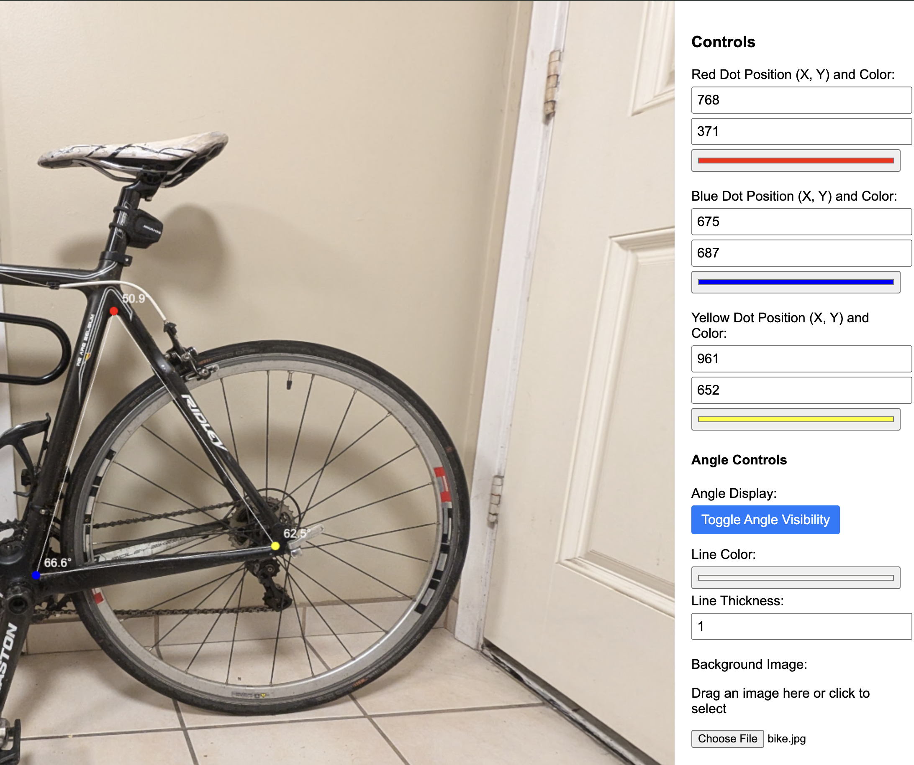

# angle-image-overlay
A simple tool to manually overlay angle dimensions on an image.

Try it here! -->
https://ericnelson12.github.io/angle-image-overlay/

# Example

Finding the angle of a bike frame

